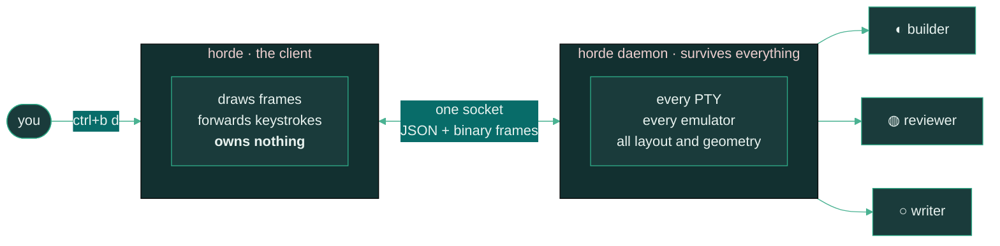

<div align="center">


<br>


**[Concepts](docs/concepts.md)** · **[Keys](docs/keys.md)** · **[Agents](docs/agents.md)** · **[Socket API](docs/socket-api.md)** · **[Config](docs/configuration.md)** · **[Orchestration](docs/orchestration.md)**

</div>

---

tmux doesn't know the difference between an agent that's thinking and one that's been waiting
twenty minutes for you to approve a file write.

horde does. A background daemon owns every PTY, so your agents keep working when you close the
terminal — and it knows which ones need you.

<div align="center">
<br>

<br>
<em>Four projects, one agent each. The sidebar groups them, so which agent belongs to which repo is something you see rather than work out.</em>
</div>

---

## The problem this solves

You're running agents across six repos. One project has three of them, another has one. They
all report `working`, and you need to know which one is stuck.

A flat list of a dozen names can't answer that. Neither can six terminal windows.

<table>
<tr><td width="50%" valign="top">

**Without horde**

- Six terminal tabs, and you remember which is which
- An agent finishes while you're away — you find out by scrolling
- Close the lid, lose the session
- "Is it thinking or is it stuck?" means reading scrollback

</td><td width="50%" valign="top">

**With horde**

- Agents grouped under the project they belong to, each with its state
- `horde digest` tells you what happened while you were gone
- Detach freely — the daemon outlives every client
- `◐ 14 tools · 3 files` vs `◐ 9 tools · 2 failed`

</td></tr>
</table>

---

## Organize what you're running

This is the part that earns its keep past two agents.

| | What it does | How |
|---|---|---|
| **Grouping** | Agents nest under their project, with a state rollup on each header | automatic |
| **Colour** | Every project gets its own accent — tab bar, sidebar dot, pane borders | automatic; `horde space accent` to change |
| **Roles** | Label what a pane is *for*: `reviewer`, `builder`, `docs` | `horde pane role %2 reviewer` |
| **Pins** | Hold the agent you're babysitting at the top, whatever project it's in | `ctrl+b P` |
| **Folding** | Collapse a project you're not looking at — it stays collapsed after a restart | `ctrl+b E` then `h` |
| **Filters** | Show only what needs you, only what's working, or every `reviewer` everywhere | `ctrl+b f` · `r` |
| **Roster** | Drop the panes, give the whole terminal to one view of everything | `ctrl+b o` |

<details>
<summary><b>Why roles, and not just names</b></summary>

<br>

Three names meet on an agent pane, and none of them substitutes for another:

| | What it is | Set by |
|---|---|---|
| **name** | how you address it in `horde send` | `horde pane rename`, else the detected agent name |
| **kind** | which program is running — `claude`, `codex` | detection |
| **role** | what it's *for* — `reviewer`, `builder`, `docs` | you |

Only the role recurs across projects. Every repo has a reviewer, and it's the same word each
time — which is what makes it the one worth grouping by, and why one command can answer "who's
reviewing, everywhere":

```sh
horde role list
```

Role names get normalised on the way in — lowercased, spaces folded to `-`, capped at 16
characters — so `Code Reviewer` and `code_reviewer` are one role rather than three. Without
that they'd fragment and stop being the thing they exist to be.

</details>

<details>
<summary><b>Why a project stores a colour <i>slot</i> and not a hex code</b></summary>

<br>

Chrome colours are resolved by the client from whichever theme it's running. A stored
`#79c0ff` would leave one project painted in the old palette after a theme change while
everything around it moved.

So a space stores which *slot* of the theme's ramp it uses. Change theme and every project
repaints together. Put a literal colour in `[theme] space_accents` instead — config outlives
`state.json`, so your choices survive `horde stop`.

The focused pane keeps its own border colour rather than the project's. Which pane has the
keyboard is the one thing that border exists to answer, and it shouldn't become a question of
hue.

</details>

---

## How it works

The split is the whole design: the client can die without disturbing a single running process.



Two consequences worth knowing:

- **Close the terminal and nothing stops.** Only the client ends. `horde` reattaches to the
  same daemon, same processes, same conversations.
- **Rebuild without killing anything.** `horde upgrade` hands every live PTY to the new binary
  over a Unix socket. Same pids throughout.

<details>
<summary><b>Install</b></summary>

<br>

```sh
cargo build --release

# Replace, never overwrite: `cp` onto a binary the running daemon is executing corrupts it
# mid-run, and macOS then kills it with SIGKILL on every exec.
rm -f ~/.local/bin/horde && cp target/release/horde ~/.local/bin/
horde upgrade                          # hand the live panes to the new binary
```

`horde upgrade` re-executes whichever binary you invoke, so install first and upgrade second.
The other way round upgrades the daemon to the build it's already running.

</details>

<details>
<summary><b>Use</b></summary>

<br>

```sh
horde                 # start the daemon if needed, then attach
horde status          # what the daemon thinks is going on
horde roster          # every agent: name, state, how long, and why
horde digest          # what happened while you were away
horde upgrade         # swap in a rebuilt binary, keeping every agent alive
horde stop            # stop the daemon and everything it owns
```

`ctrl+b d` detaches. Your agents keep running.

</details>

<details>
<summary><b>Keys</b></summary>

<br>

Prefix is `ctrl+b`, and `ctrl+b ?` lists everything. Every action is rebindable by name —
`horde keys` prints them.

| | |
|---|---|
| `\|` `-` | split right / down |
| `h j k l` | move focus — resolved by geometry, not tree position |
| `H J K L` | resize; `ctrl+h/j/k/l` swaps panes |
| `z` `x` | zoom / close pane |
| `c` `n` `p` `1`-`9` | new tab / next / prev / go to |
| `s` `S` | space switcher / new space |
| **`a`** | **jump to the next agent that needs you** |
| **`o`** | **the roster — every project and agent, full screen** |
| `E` `P` | walk the sidebar with `j`/`k` / pin the focused agent |
| `f` | filter the agent list |
| `e` `b` | toggle sidebar / bus drawer |
| `g` `.` `?` | command palette / settings / keys |
| `,` | rename the focused pane |
| `d` `D` | detach / digest |

`ctrl+b a` is the one that earns its keep once you have more than two agents: it walks the
queue of agents that are `blocked` or `done`, so you never hunt for the one waiting on you.

**Right-click anything** for a menu built from what's under the cursor — a pane, a space row,
an agent row, a tab. Every entry shows its keyboard equivalent, so the menu teaches the keys
rather than replacing them.

</details>

<details>
<summary><b>Agents, and how their state is worked out</b></summary>

<br>

An agent is a program in a pane that horde recognises — `claude`, `codex`, `gemini`,
`cursor-agent`, `aider`, `opencode`. horde doesn't launch them any differently; it watches
them.

States are `working ◐`, `blocked ◍`, `done ●`, `idle ○`, `unknown ◌`. Two are load-bearing:

- **`blocked`** means waiting on a human decision — an approval or permission prompt. Silence
  is never treated as blocked.
- **`done`** means finished while you weren't looking. It clears when you look at the pane,
  which is what makes the sidebar worth glancing at.

Detection runs in two tiers, and only one is ever in charge of a pane. **Lifecycle hooks** are
authoritative — install them and the agent reports its own state:

```sh
horde integration install claude
```

That merges into `~/.claude/settings.json`, backs the file up first, leaves other tools' hooks
alone, and is safe to re-run. Restart running Claude sessions afterwards.

**Screen manifests** are the fallback: horde reads the foreground process and matches regexes
from `agents/*.toml` against the live bottom of the pane buffer.

Hooks are worth installing. Screen detection reads whatever is on screen, and a narrow pane
truncates the very marker it depends on — Claude's `esc to interrupt` sits at the end of a long
status line, so a 22-column pane hides it and a working agent looks idle. Hooks don't care how
wide your panes are.

</details>

<details>
<summary><b>Configuration</b></summary>

<br>

`~/.config/horde/config.toml`. horde runs with no config file at all; everything has a default.

```toml
prefix = "ctrl+b"

[theme]
name = "horde"                              # horde · tokyo-night · catppuccin · gruvbox · terminal
space_accents = ["#79c0ff", "#d2a8ff"]      # colours projects are tinted with, by position

[[roles]]
name = "reviewer"
color = "#79c0ff"
glyph = "◈"

[ui]
sidebar_width = 24                          # 14–60
animate = true                              # spinners for working agents
```

`ctrl+b .` opens a settings page for the same values. Writing goes through `toml_edit`, so
comments and formatting in a hand-edited file survive.

Full reference: [`docs/configuration.md`](docs/configuration.md).

</details>

---

## Honest caveats

- **The bus and the task board are paused.** Agent-to-agent messaging and the shared work
  queue are switched off in code while they're reworked. `horde bus tail` and `horde task list`
  still read their logs; nothing can be sent or claimed. Everything else on this page works.
- macOS and Linux. No Windows.
- The socket path has to stay under ~100 bytes — an OS limit on `AF_UNIX`. Set `HORDE_SOCKET`
  if your config directory is deep.
- Not implemented: dragging pane borders to resize (use `H J K L`), and OSC 52 clipboard
  forwarding.

---

## Point your agents at this

An agent can't discover any of this on its own. Tell it once — in `CLAUDE.md`, a system prompt,
or the first thing you say to it:

```
You are running inside horde, a terminal multiplexer where agents can talk to each other.
Run `horde docs orchestration` to learn how, then `horde roster` to see who else is here.
```

Every horde pane carries `HORDE_DOCS` in its environment holding that exact command, so an
agent that inspects its environment will find it.

---

<div align="center">
<br>

<br><br>
<sub>Built at <b>The Amazon Whisperer</b> · Rust + <a href="https://github.com/ratatui/ratatui">ratatui</a> · one binary, no runtime</sub>
</div>
