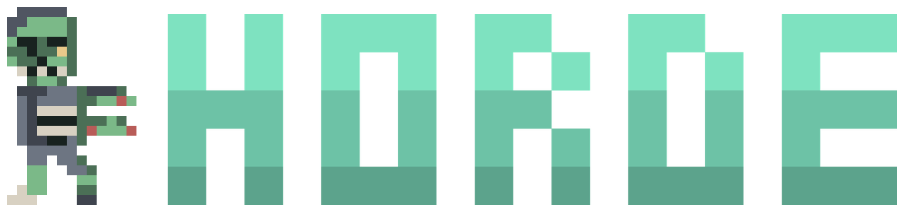
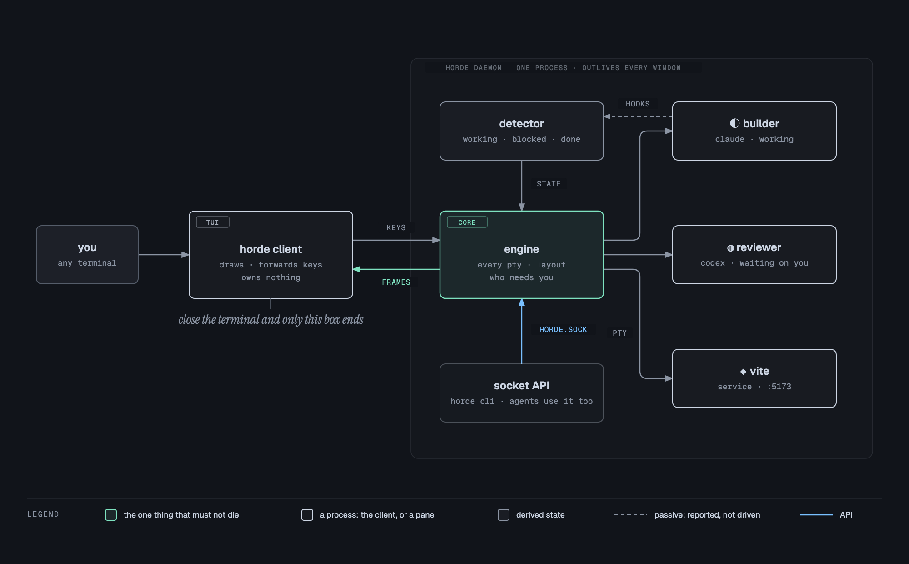

<div align="center">



<br>

**A terminal multiplexer where your coding agents work together.**

They start each other, message each other, share a task queue, and keep running when you close the window.

<br>


**[Install](#install)** · **[First five minutes](#the-first-five-minutes)** · **[Agents together](#agents-that-work-together)** · **[How it works](#how-it-works)** · **[Keys](docs/keys.md)** · **[Agents](docs/agents.md)** · **[Config](docs/configuration.md)** · **[Socket API](docs/socket-api.md)** · **[Unattended](docs/unattended.md)**

</div>

---

# Agents that work together. One screen that shows you all of them.

Most tools give one agent one chat window. horde gives you a place where agents can start other agents, hand each other work, ask a question and wait for the answer, and pull jobs from a shared queue. Each one gets its own terminal, and if they share a repo, its own git worktree, so nobody overwrites anybody.

You see all of it in one window. Which agent is working, which one finished, which one is sitting at a permission prompt waiting for you. Close the window and nothing stops, because a background daemon owns every terminal. Come back and `horde digest` tells you what happened while you were gone.

<div align="center">
<br>

<br>
<em>Four projects, one agent each. The sidebar shows which agent belongs to which repo, and what each is doing right now.</em>
</div>

<table>
<tr><td width="50%" valign="top">

**One agent, one window**

- You are the router. Every handoff goes through you
- Two agents in one repo means one of them loses work
- Ten jobs means you deciding who does what, ten times
- Close the lid, lose the session
- Nothing happens unless you are sitting there

</td><td width="50%" valign="top">

**A horde**

- `horde send`, `horde ask`, `horde broadcast`. Agents talk to each other
- `--worktree` gives each agent its own tree and branch, beside the repo
- `horde task add` ten times. Three agents drain the queue themselves
- Detach any time. The daemon outlives every window
- Scheduled rules start agents while you sleep, with guards you set

</td></tr>
</table>

---

## Install

```sh
cargo install horde
horde
```

That is the multiplexer, and it is complete on its own. Everything above this line, and everything in [Agents that work together](#agents-that-work-together), works with that install.

### The kit

Some of what is below is an optional layer called the **kit**: a kanban board (`ctrl+b T`), a vault of notes agents can write to, a file editor with language servers, a dependency graph, and inline images. It ships in the same binary behind a build flag:

```sh
cargo install horde --features full
```

Both builds read the same config. `[kit] enabled = true` turns the kit on in a plain build, `false` turns it off in a full one, and neither needs a reinstall. Sections that need it say so at the top. [docs/kit.md](docs/kit.md) explains why it is a flag and not a plugin.

<details>
<summary><b>Installing from a clone</b></summary>

<br>

```sh
cargo build --release                               # add --features full for the kit
rm -f ~/.local/bin/horde && cp target/release/horde ~/.local/bin/
codesign --force --sign - ~/.local/bin/horde        # macOS only
horde upgrade                                       # hand the live panes to the new binary
```

Two of those lines matter more than they look.

**`rm -f` before `cp`.** Copying onto the file a running daemon was launched from changes the executable underneath a live process. Removing it first gives the new binary its own inode and leaves the running one alone.

**`codesign` after, on macOS.** Replacing a binary at a path a running process was launched from poisons the kernel's signature cache for that path. Every later launch then dies with `SIGKILL` and no output, including `horde --version`, while the same bytes run fine from anywhere else. It looks like a broken daemon. It is not. Re-signing clears it.

`horde upgrade` runs whichever binary you invoke, so install first and upgrade second.

</details>

---

## The first five minutes

```sh
horde                                  # start the daemon, then attach
horde integration install claude       # let Claude Code report its own state
horde spawn --cmd claude --name builder
```

Now tell that agent it has company:

```
You are running inside horde. Run `horde docs orchestration` to learn how to
start other agents and talk to them, then `horde roster` to see who is here.
```

`ctrl+b d` detaches. Your agents keep running. `ctrl+b ?` lists every key.

<details>
<summary><b>Everyday commands</b></summary>

<br>

```sh
horde status          # what the daemon thinks is going on
horde roster          # every agent: name, state, how long, and why
horde digest          # what happened while you were away
horde bus tail        # what the agents have been saying to each other
horde worktree list   # every tree horde made, and who is in each
horde theme list      # every palette, the built-ins and your own
horde stop            # stop the daemon and everything it owns
```

</details>

---

## Agents that work together

Every horde pane carries `HORDE_PANE` and `HORDE_DOCS` in its environment, so an agent can find out where it is and read the same manual you can. From there it has the whole CLI. These are the patterns that come up.

**Start a team.** An agent spawns agents. Each gets a name, a job, and if you say so, its own worktree.

```sh
horde spawn --cmd claude --name parser --role builder --worktree --board --task "port the old parser"
horde spawn --cmd codex  --name reviewer --role reviewer --worktree
```

**Ask and wait.** `ask` blocks until the other agent replies, and prints the reply, so it composes like any other shell command.

```sh
verdict=$(horde ask reviewer "is the migration in src/db/*.rs sound?")
```

**Work a queue instead of dispatching.** Put the jobs on the project's board. Agents claim the oldest open one, do it, report, and go back for more. A fast agent takes more. An agent that dies mid-task returns it to the board instead of losing it.

```sh
for f in src/*.rs; do horde task add "review $f and report anything broken"; done
horde broadcast "run: while w=\$(horde task claim); [ -n \"\$w\" ]; do <do \$w>; horde task done --result \"<summary>\"; done"
horde task list                  # watch it drain
```

**Hand work down a chain.** Each stage is told who to notify next.

```sh
horde send builder  "implement the migration, then: horde send reviewer \"ready for review\""
horde send reviewer "when told, review it, then: horde send tester \"approved\""
```

A message arrives in the other agent's terminal as if you had typed it, prefixed `[horde] message from builder:`. If the target is mid-turn or sitting at a permission prompt, horde holds the message and delivers it when it is safe, because typing into a prompt that says "approve this file write?" would answer it. `queued` is not a failure.

Everything the agents say to each other is recorded. `horde bus tail` is the transcript.

Full guide, written for the agents themselves: **[docs/orchestration.md](docs/orchestration.md)**. Agents can read it with `horde docs orchestration`.

---

## How it works

One process owns the terminals. The window you look at is a client that draws frames and forwards keys, and owns nothing. Close it and only the client ends. Agents reach the daemon through the same socket the client does.

<div align="center">
<br>

<br>
</div>

Two things fall out of that split:

- **Close the terminal and nothing stops.** `horde` reattaches to the same daemon, same processes, same conversations.
- **Rebuild without killing anything.** `horde upgrade` hands every live terminal to the new binary over a socket. Same pids before and after.

---

## What horde keeps track of

This is the part that earns its keep past two agents.

| | What it does | How |
|---|---|---|
| **Grouping** | Agents nest under their project, with a state rollup on each header | automatic |
| **Colour** | Every project gets its own accent, across the tab bar, sidebar and pane borders | automatic; `horde space accent` to change |
| **Memory** | Notes a project keeps for its agents, so context survives a compaction | `horde memory save`, or drag one onto an agent |
| **Roles** | Label what a pane is for: `reviewer`, `builder`, `docs` | `horde pane role %2 reviewer` |
| **Pins** | Hold the agent you are babysitting at the top, whatever project it is in | `ctrl+b P` |
| **Folding** | Collapse a project you are not looking at. It stays collapsed after a restart | `ctrl+b E` then `h` |
| **Filters** | Show only what needs you, only what is working, or every `reviewer` everywhere | `ctrl+b f` · `r` |
| **Roster** | Drop the panes and give the whole terminal to one view of everything | `ctrl+b o` |
| **Approvals** | Every blocked agent's question in one list, answered without switching panes | `ctrl+b A` |
| **Worktrees** | Give each agent its own git worktree, so a fleet in one repo cannot overwrite itself | `--worktree` |
| **Fleets** | An agent spawns a team: roles, models, worktrees, and work on the board | `horde spawn` |

<details>
<summary><b>Why roles, and not just names</b></summary>

<br>

Three names meet on an agent pane, and none of them stands in for another:

| | What it is | Set by |
|---|---|---|
| **name** | how you address it in `horde send` | `horde pane rename`, else the detected agent name |
| **kind** | which program is running: `claude`, `codex` | detection |
| **role** | what it is for: `reviewer`, `builder`, `docs` | you |

Only the role recurs across projects. Every repo has a reviewer, and it is the same word each time. That makes it the one worth grouping by, and it is why one command can answer "who is reviewing, everywhere":

```sh
horde role list
```

Role names are normalised on the way in: lowercased, spaces folded to `-`, capped at 16 characters. `Code Reviewer` and `code_reviewer` become one role instead of three.

</details>

<details>
<summary><b>One tree per agent</b></summary>

<br>

Two agents editing the same file on the same branch is not a merge conflict you get to resolve. It is one agent's work silently overwritten, usually found an hour later.

```sh
horde spawn --cmd claude --name ads --worktree
horde spawn --cmd claude --name ops --worktree
```

Each lands beside the project, on its own branch:

```
~/dev/WCP        main          you
~/dev/WCP-ads    horde/ads     ads
~/dev/WCP-ops    horde/ops     ops
```

Beside rather than inside, on purpose. A worktree nested in the repository has to be hidden from `git status`, sits inside the blast radius of `git clean -ffdx`, and is a directory agents wander into while searching their own project. A sibling has none of those problems, and it is a layout you can see in your editor's file list.

**The branch is what marks a tree as horde's, not the path.** Everything horde makes is on `horde/<name>`, so a worktree you made yourself is never listed and never removable, wherever you put it.

It is **opt-in**, and agents are told to keep it that way. A worktree is a directory on your disk and a branch in your repository, and neither is an agent's to create uninvited.

Worktrees survive a closed pane. Nothing an agent produced should be lost by closing a window. `horde worktree remove` is the only thing that deletes one, and it refuses while a pane is still in it or while the tree has uncommitted work.

Full reasoning: **[docs/worktrees.md](docs/worktrees.md)**.

</details>

<details>
<summary><b>Why a project stores a colour slot and not a hex code</b></summary>

<br>

The client resolves chrome colours from whichever theme it is running. A stored `#79c0ff` would leave one project painted in the old palette after a theme change while everything around it moved.

So a space stores which slot of the theme's ramp it uses. Change theme and every project repaints together. To pin a literal colour, put it in `[theme] space_accents` instead. Config outlives `state.json`, so that choice survives `horde stop`.

The focused pane keeps its own border colour rather than the project's. Which pane has the keyboard is the one thing that border exists to answer.

</details>

---

## Panes, splits and layouts

Panes tile edge to edge. No floating windows, no gaps, no pane you have to go and find.

```sh
horde layout dev      # solo · duo · trio · dev · quad
```

| Preset | Shape |
|---|---|
| `solo` | one pane, everything else closed |
| `duo` | two side by side |
| `trio` | one tall on the left, two stacked on the right |
| `dev` | a main pane with a logs strip beneath, plus a side column |
| `quad` | 2×2 |

A preset spawns or closes panes to match its count, so `horde layout quad` from one pane gives you four rather than an error.

<details>
<summary><b>Moving, resizing and rearranging</b></summary>

<br>

| Key | What it does |
|---|---|
| `←` `↓` `↑` `→` | **split**. The new pane goes where you point |
| `\|` `-` | split right / down, tmux's keys (`%` and `"` also work) |
| `h` `j` `k` `l` | move focus, resolved by geometry rather than tree position |
| `H` `J` `K` `L` | resize the focused edge |
| `ctrl+h/j/k/l` | swap this pane with its neighbour |
| `z` | zoom. One pane takes the frame, the tree is untouched |
| `x` | close |
| `c` `n` `p` `1`–`9` | tabs: new, next, prev, go to |

**Focus by geometry is the one worth calling out.** In a split tree, "the pane to my right" and "my sibling in the tree" stop agreeing the moment you split twice. horde resolves `l` against the drawn rectangles, so it goes where your eye goes.

**Geometry lives in the daemon and nowhere else.** The client draws where it is told. A pane's terminal size and its drawn rectangle can never drift apart, because a resize is one calculation rather than two that have to agree.

Tabs are layouts inside a project. Use them to separate views like `agents`, `logs` and `review`. Projects are spaces.

**Mouse works too.** Click a pane or a sidebar row to focus, click a tab to switch, scroll for scrollback. Drag to highlight and it copies on release. If a program has taken the mouse for itself, `shift`-drag takes it back.

</details>

---

## Your own board, next to theirs

> **Kit.** This needs `cargo install horde --features full`, or `[kit] enabled = true`. See [Install](#install).

`ctrl+b T` opens a kanban: columns you name, cards with due dates, tags, descriptions and a comment thread. Drag a card with the mouse, or `H` and `L` it across. `v` swaps the columns for a flat list sorted by what is due next.

It is deliberately **not** the task board agents pull work from. That board's rules are written for them. Claiming is a compare-and-set, and an open task stops being offered after a day. None of that makes sense for work you are keeping track of yourself.

The two meet at one seam, and only when you ask. Arm a card and horde hands it to the agents as its due date approaches:

```
 #12  wire up the importer
   due      2026-08-18 · in 2d
   agents   hand over when due within 3d

 COMMENTS  2
   horde              handed to the agents as task #47
   builder            done. chunked reader, tests green
```

The agent gets an ordinary task on its own board, scoped to the card's project. Its result comes home as a comment. **The card does not move.** Deciding a thing is finished is the part you wanted a board for.

`horde docs kanban` for the rest.

---

## When nobody is watching

Detach and horde keeps going. Arm it and horde starts acting.

A rule is **when × what × guard**. The guard is the whole engineering problem. The rest is plumbing.

```sh
horde trigger add --at 09:00 --days mon-fri --spawn claude --name morning
horde trigger add --every 30m --when "! cargo test -q" --spawn claude --name on-red
horde trigger list
```

| | Options |
|---|---|
| **when** | `--every 30m` · `--at 09:00` with `--days mon-fri` · `--when "<shell cmd>"`, acting when it exits 0 |
| **what** | `--spawn <cmd>` starts an agent |
| **guard** | see below. This is what makes it safe to arm |

Nothing fires until you say so. `triggers.unattended` is off by default, because acting with nobody present is a different promise from running alongside you, and it has to be asked for.

<details>
<summary><b>The guards, and why each one is there</b></summary>

<br>

| Guard | Why |
|---|---|
| Master switch off by default | Arming is a decision, not a default |
| `--every` floors at **60s** | A rule that fires every second is a fork bomb with a schedule |
| **12 firings per rolling hour**, across all rules | Agents can create rules, so the failure mode is not one bad rule. It is fifty. Hitting the ceiling warns once an hour rather than silently doing nothing |
| One firing in flight per rule | A slow action cannot stack copies of itself |
| `max_spawned`, default **2**, capped at **16** | How many full-permission agents may work with nobody present. Counted live, so a finished one frees its slot |
| No rule-making by machine-started agents | Otherwise the loop closes with no human anywhere in it |
| A failed action still counts as a firing | Or a broken rule would retry forever inside its budget |

**Provenance is its own guard.** A pane horde started is marked `[by trigger #3]` and stays marked, through a restart and through `horde upgrade`. That is what stops a machine-started agent quietly inheriting the rights of one you started yourself.

</details>

<details>
<summary><b>Catching up: <code>horde digest</code></b></summary>

<br>

Detach, go to lunch, come back. Instead of five panes of scrollback:

```
while you were away · 42m

  needs you
    ◍ reviewer         stuck 12m    approval prompt

  finished
    ● builder          4m           22 tools · 6 files

  horde decided
    ◈ #3  09:00 mon-fri → spawned claude as morning

  exited
    ✕ worker3
```

The order is by what would make you act: what is stuck, then what finished, then what horde did on its own, then the chatter.

The window is since you last looked. Reading advances the marker, so ignoring digests widens the window instead of losing history. `--keep` looks without advancing it.

```sh
horde digest                # since you last looked
horde digest --since 2h     # a wider window
horde digest --json         # for scripts
```

</details>

<details>
<summary><b>Reaching you when nothing is attached</b></summary>

<br>

Notifications exist so an armed daemon can tell you something without a window to toast into.

```toml
[notifications]
delivery = "system"                  # horde · system · off
command = "~/bin/horde-ping"         # your script, your service
```

Your command gets a one-line summary as `$1` and the full digest as JSON on stdin. That is deliberately all of it. Pushover, Telegram, ntfy and email stay out of horde and in a script you own, with no secret store and no built-in HTTP client to go stale.

</details>

---

## Any model, including the free ones

horde never talks to a model. It runs the agent, and the agent owns its provider. Pointing a fleet at OpenRouter's free tier is a config file, not an integration.

```toml
# ~/.config/horde/config.toml
[models.free]
cmd = "opencode --model openrouter/{model}"
order = [
  "cohere/north-mini-code:free",
  "nvidia/nemotron-3-ultra-550b-a55b:free",
  "openai/gpt-oss-20b:free",
]
```

```sh
opencode auth login --provider openrouter --method api-key   # once; the key stays in opencode
horde spawn --profile free --name builder
```

`{model}` is filled from `order`, and `--profile` starts at the head of the list. A complete working config is committed as **[config.example.toml](config.example.toml)**.

<details>
<summary><b>Why the key is not in horde's config</b></summary>

<br>

`opencode auth login` puts it in opencode's own `~/.local/share/opencode/auth.json`. horde never reads it, never logs it, and never writes it to `state.json`. There is no HTTP client anywhere in the codebase for the same reason. The moment a multiplexer holds a key it acquires a threat model and a reason to sit in the request path of every agent.

For a tool that only reads its key from the environment, `[env]` hands variables to every pane:

```toml
[env]
SOME_PROVIDER_KEY = "..."
```

Values there are treated as secrets, never logged and never persisted. The cost is deliberate: a mistyped key fails with nothing in horde's log to explain it, which is better than a key that outlives every session that could have used it.

</details>

<details>
<summary><b>What the list is for</b></summary>

<br>

Free models run out. `order` is the sequence to fall through, best first, and it does **not** wrap. A fleet that has spent every model should stop and say so rather than loop back to the one that just refused it.

An unknown profile name is refused rather than defaulted. Quietly starting `claude` when you asked for the free tier spends the wrong budget on the wrong provider and looks like it worked.

Automatic switching, noticing a model is exhausted and moving the agent without losing its session, is designed in [PLAN-models.md](PLAN-models.md) and not built yet.

</details>

---

## Reference

<details>
<summary><b>Keys</b></summary>

<br>

Prefix is `ctrl+b`, and `ctrl+b ?` lists everything. Every action is rebindable by name. `horde keys` prints them.

| | |
|---|---|
| **`a`** | **jump to the next agent that needs you** |
| **`o`** | **the roster: every project and agent, full screen** |
| `E` `P` | walk the sidebar with `j`/`k` / pin the focused agent |
| `f` | filter the agent list |
| `s` `S` | space switcher / new space |
| `e` `b` | toggle sidebar / bus drawer |
| `g` `.` `?` | command palette / settings / keys |
| `,` | rename the focused pane |
| `d` `D` | detach / digest |

Splits, focus and resize are in **[Panes, splits and layouts](#panes-splits-and-layouts)** above.

`ctrl+b a` is the one that earns its keep once you have more than two agents. It walks the queue of agents that are `blocked` or `done`, so you never hunt for the one waiting on you.

**Right-click anything** for a menu built from what is under the cursor. Every entry shows its keyboard equivalent, so the menu teaches the keys rather than replacing them.

</details>

<details>
<summary><b>Agents, and how their state is worked out</b></summary>

<br>

An agent is a program in a pane that horde recognises: `claude`, `codex`, `gemini`, `cursor-agent`, `aider`, `opencode`. horde does not launch them any differently. It watches them.

States are `working ◐`, `blocked ◍`, `done ●`, `idle ○`, `unknown ◌`, `serving ◆`. Three carry weight:

- **`blocked`** means waiting on a human decision, an approval or a permission prompt. Silence is never treated as blocked.
- **`done`** means finished while you were not looking. It clears when you look at the pane, which is what makes the sidebar worth glancing at.
- **`serving`** is not an agent at all. A pane running `npm run dev`, a watcher or a tunnel is recognised as a service: its own sidebar section, its own colour, never handed work, and never `done`, because a dev server has no finish to read. Its row shows where it is answering (`:5173`) rather than the word `serving`.

`ctrl+b A` opens the **approval queue**: every blocked agent in one list, longest wait first, with the question read off its screen and answerable in place.

```
◍ reviewer   Halo Suite   waiting 12m
  Do you want to make this edit to src/mux.rs?
    1  Yes
    2  Yes, and don't ask again
    3  No, and tell Claude what to do differently
```

Only the agent under the cursor shows its options, and a key it did not offer does nothing. When the prompt cannot be read, the agent is still listed with `enter` to go and look. It will not guess.

Detection runs in two tiers, and only one is ever in charge of a pane. **Lifecycle hooks** are authoritative. Install them and the agent reports its own state:

```sh
horde integration install claude
```

That merges into `~/.claude/settings.json`, backs the file up first, leaves other tools' hooks alone, and is safe to re-run. Restart running Claude sessions afterwards.

**Screen manifests** are the fallback: horde reads the foreground process and matches patterns from `agents/*.toml` against the live bottom of the pane.

Hooks are worth installing. Screen detection reads whatever is on screen, and a narrow pane truncates the very marker it depends on. Hooks do not care how wide your panes are.

</details>

<details>
<summary><b>Scripting it</b></summary>

<br>

Everything the TUI does goes through one socket, and the control half is newline-delimited JSON on purpose, so it can be debugged with `nc` and driven from anything that writes a line.

```sh
horde api space.list
horde api pane.role --params '{"pane": 2, "role": "reviewer"}'
horde roster --json | jq '.[] | select(.state == "blocked")'
```

Every `horde <noun> <verb>` command is one call against that API. Full method list: **[docs/socket-api.md](docs/socket-api.md)**.

</details>

<details>
<summary><b>Configuration</b></summary>

<br>

`~/.config/horde/config.toml`. horde runs with no config file at all. Everything has a default.

```toml
prefix = "ctrl+b"

[theme]
name = "horde"                              # or tokyo-night · catppuccin · gruvbox · nord · rose-pine
space_accents = ["#79c0ff", "#d2a8ff"]      # colours projects are tinted with, by position

[[roles]]
name = "reviewer"
color = "#79c0ff"
glyph = "◈"

[ui]
sidebar_width = 24                          # 14 to 60
animate = true                              # spinners for working agents
zombie = true                               # something crosses the start screen now and then

[triggers]
unattended = false                          # master switch: no rule fires until this is on
max_spawned = 2                             # agents horde may run that it started itself
```

`ctrl+b .` opens a settings page for the same values. Writes go through `toml_edit`, so comments and formatting in a hand-edited file survive.

Themes are files. `horde theme edit gruvbox --as mine` writes one you can change, and three lines make a theme of your own. A section horde does not recognise is dropped with a warning rather than invalidating the file, so sharing the config with another tool is safe.

Full reference: **[docs/configuration.md](docs/configuration.md)**.

</details>

---

## Honest caveats

- **The idle nudge is off by default.** The board works by hand. The half that tells an idle agent there is work waiting needs `agents.task_nudge = true`. It is off because it is the part that acts without being asked, and it is worth watching the board behave for a day before switching it on.
- **One machine.** horde is a local tool. No cloud, no plugin marketplace, no remote host management, and that is on purpose.
- macOS and Linux natively, Windows through WSL2 (`horde docs wsl`). There is no native Windows build and there will not be one: a ConPTY cannot be asked what is running inside it, which is most of what horde is for.
- The socket path has to stay under about 100 bytes, an OS limit on `AF_UNIX`. Set `HORDE_SOCKET` if your config directory is deep.
- Glyph widths in the private-use area (Nerd Font icons) are measured by asking the terminal at startup, because no table agrees with every host. A terminal that does not answer costs two seconds at launch and falls back to the Unicode tables.
- Not implemented: dragging pane borders to resize. Use `H J K L`.

---

## Point your agents at this

An agent cannot discover any of this on its own. Say it once, in `CLAUDE.md` or a system prompt, and every pane carries `HORDE_DOCS` in its environment holding the command to read the rest:

```
You are running inside horde, a terminal multiplexer where agents can talk to each other.
Run `horde docs orchestration` to learn how, then `horde roster` to see who else is here.
```

---

## Prior art

horde owes its premise to **[herdr](https://github.com/herdrdev/herdr)**: a terminal multiplexer that knows what the agent inside a pane is doing, rather than one that just holds its terminal. That idea and several that follow from it are theirs: per-agent lifecycle states, a CLI complete enough that agents drive it themselves, one git worktree per agent so a fleet in a single repo cannot overwrite itself.

horde is a separate implementation and carries none of herdr's code, but it would not have this shape without herdr going first. It is Apache-2.0 and it is worth your time: **[herdr.dev](https://herdr.dev)**.

---

<sub>Built by <b>Josh Bonhage</b> · Rust + <a href="https://github.com/ratatui/ratatui">ratatui</a> · one binary, no runtime</sub>
