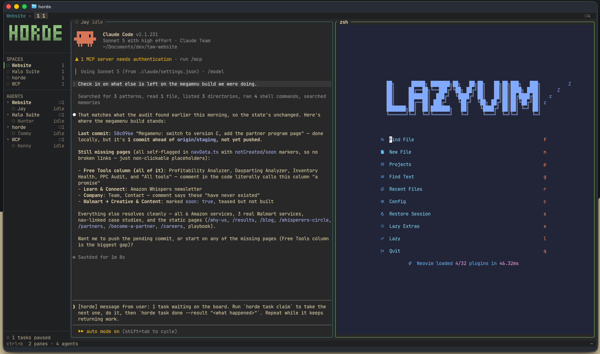

<div align="center">


<br>


**[Concepts](docs/concepts.md)** · **[Keys](docs/keys.md)** · **[Agents](docs/agents.md)** · **[Socket API](docs/socket-api.md)** · **[Config](docs/configuration.md)** · **[Unattended](docs/unattended.md)** · **[Orchestration](docs/orchestration.md)**

</div>

---

# You are the bottleneck in your own agent fleet.

Six repos. Nine agents. Every one of them finishes, gets stuck, or asks a question at a moment
you didn't pick — and the only thing standing between "done" and "still sitting there" is you
remembering to go and look.

tmux can't help. It doesn't know the difference between an agent that's thinking and one that's
been waiting twenty minutes for you to approve a file write.

horde does. A background daemon owns every PTY, so your agents keep working when you close the
terminal. It knows which ones need you. And when you're not there at all, it can act on its own.

<div align="center">
<br>

<br>
<em>Four projects, one agent each. The sidebar groups them, so which agent belongs to which repo is something you see rather than work out.</em>
</div>

---

<table>
<tr><td width="50%" valign="top">

**Without horde**

- Six terminal tabs, and you remember which is which
- An agent finishes while you're away — you find out by scrolling
- Close the lid, lose the session
- "Is it thinking or is it stuck?" means reading scrollback
- Nothing happens unless you're sitting there

</td><td width="50%" valign="top">

**With horde**

- Agents grouped under the project they belong to, each with its state
- `horde digest` tells you what happened while you were gone
- Detach freely — the daemon outlives every client
- `◐ 14 tools · 3 files` vs `◐ 9 tools · 2 failed`
- Scheduled rules that start agents while you sleep

</td></tr>
</table>

---

## Organize what you're running

This is the part that earns its keep past two agents.

| | What it does | How |
|---|---|---|
| **Grouping** | Agents nest under their project, with a state rollup on each header | automatic |
| **Colour** | Every project gets its own accent — tab bar, sidebar dot, pane borders | automatic; `horde space accent` to change |
| **Roles** | Label what a pane is *for*: `reviewer`, `builder`, `docs` | `horde pane role %2 reviewer` |
| **Pins** | Hold the agent you're babysitting at the top, whatever project it's in | `ctrl+b P` |
| **Folding** | Collapse a project you're not looking at — it stays collapsed after a restart | `ctrl+b E` then `h` |
| **Filters** | Show only what needs you, only what's working, or every `reviewer` everywhere | `ctrl+b f` · `r` |
| **Roster** | Drop the panes, give the whole terminal to one view of everything | `ctrl+b o` |
| **Approvals** | Every blocked agent's question in one list, answered without switching panes | `ctrl+b A` |
| **Worktrees** | Give each agent its own git worktree, so a fleet in one repo can't overwrite itself | `--worktree` |
| **Fleets** | An agent spawns a team: roles, models, worktrees, and work on the board | `horde spawn` |

<details>
<summary><b>Why roles, and not just names</b></summary>

<br>

Three names meet on an agent pane, and none of them substitutes for another:

| | What it is | Set by |
|---|---|---|
| **name** | how you address it in `horde send` | `horde pane rename`, else the detected agent name |
| **kind** | which program is running — `claude`, `codex` | detection |
| **role** | what it's *for* — `reviewer`, `builder`, `docs` | you |

Only the role recurs across projects. Every repo has a reviewer, and it's the same word each
time — which is what makes it the one worth grouping by, and why one command can answer "who's
reviewing, everywhere":

```sh
horde role list
```

Role names get normalised on the way in — lowercased, spaces folded to `-`, capped at 16
characters — so `Code Reviewer` and `code_reviewer` are one role rather than three. Without
that they'd fragment and stop being the thing they exist to be.

</details>

<details>
<summary><b>One tree per agent</b></summary>

<br>

Two agents editing the same file on the same branch is not a merge conflict you get to
resolve. It is one agent's work silently overwritten, usually found an hour later.

```sh
horde spawn --cmd claude --name builder  --worktree
horde spawn --cmd claude --name reviewer --worktree
```

Each lands in `<repo>/.horde/worktrees/<name>` on its own `horde/<name>` branch, and starts
there. Both can run the full test suite and rewrite the same file, and neither can touch what
the other is holding.

Two details, both checked rather than assumed. horde writes `.horde/` to **`.git/info/exclude`**,
which is per-clone and untracked, so nothing the repository owns is modified — without it the
first agent to run `git add -A` in the main tree commits a mess. And the **leading dot** is what
keeps the worktrees out of every agent's search results; `horde-worktrees/` would return one hit
per worktree per match.

Worktrees survive a closed pane, deliberately: nothing an agent produced should be lost by
closing a window. `horde worktree list` shows them and who is in each, `horde worktree remove`
is the only thing that deletes one, and it refuses while a pane is still in it or while the
tree has uncommitted work.

Full reasoning, including what `git clean` can still do to them: `horde docs worktrees`.

</details>

<details>
<summary><b>Why a project stores a colour <i>slot</i> and not a hex code</b></summary>

<br>

Chrome colours are resolved by the client from whichever theme it's running. A stored
`#79c0ff` would leave one project painted in the old palette after a theme change while
everything around it moved.

So a space stores which *slot* of the theme's ramp it uses. Change theme and every project
repaints together. Put a literal colour in `[theme] space_accents` instead — config outlives
`state.json`, so your choices survive `horde stop`.

The focused pane keeps its own border colour rather than the project's. Which pane has the
keyboard is the one thing that border exists to answer, and it shouldn't become a question of
hue.

</details>

---

## Panes, splits and layouts

Panes tile edge to edge in a binary space partition tree. No floating windows, no gaps, no
pane you have to go find.

```sh
horde layout dev      # solo · duo · trio · dev · quad
```

| Preset | Shape |
|---|---|
| `solo` | one pane, everything else closed |
| `duo` | two side by side |
| `trio` | one tall on the left, two stacked on the right |
| `dev` | a main pane with a short logs strip beneath, plus a side column |
| `quad` | 2×2 |

A preset spawns or closes panes to match its count, so `horde layout quad` from one pane gives
you four rather than an error.

<details>
<summary><b>Moving, resizing and rearranging</b></summary>

<br>

| Key | What it does |
|---|---|
| `\|` `-` | split right / down (`%` and `"` also work) |
| `h` `j` `k` `l` | move focus — **resolved by geometry, not tree position** |
| `H` `J` `K` `L` | resize the focused edge |
| `ctrl+h/j/k/l` | swap this pane with its neighbour |
| `z` | zoom — one pane takes the frame, the tree is untouched |
| `x` | close |
| `c` `n` `p` `1`–`9` | tabs: new, next, prev, go to |

**Focus by geometry is the one worth calling out.** In a BSP tree, "the pane to my right" and
"my sibling in the tree" stop agreeing the moment you split twice. horde resolves `l` against
the drawn rectangles, so it goes where your eye goes.

**Geometry lives in the daemon and nowhere else.** The client draws where it's told. That's why
a pane's PTY size and its drawn rectangle can never drift apart — a resize is one calculation,
not two that have to agree.

Tabs are layouts *inside* a project: use them to separate views — `agents`, `logs`, `review` —
rather than to separate projects. Projects are spaces.

**Mouse works too.** Click a pane or a sidebar row to focus, click a tab to switch, scroll for
scrollback. Drag to highlight and it copies on release. If a program has taken the mouse for
itself, `shift`-drag takes it back.

</details>

---

## When nobody's watching

Detach and horde keeps going. Arm it and horde starts *acting*.

A rule is **when × what × guard**. The guard is the whole engineering problem; the rest is
plumbing over things that already existed.

```sh
horde trigger add --at 09:00 --days mon-fri --spawn claude --name morning
horde trigger add --every 30m --when "! cargo test -q" --spawn claude --name on-red
horde trigger list
```

| | Options |
|---|---|
| **when** | `--every 30m` · `--at 09:00` with `--days mon-fri` · `--when "<shell cmd>"`, acting when it exits 0 |
| **what** | `--spawn <cmd>` starts an agent |
| **guard** | see below — this is the part that makes it safe to arm |

Nothing fires until you say so. `triggers.unattended` is off by default, because acting with
nobody present is a different promise from running side by side and has to be asked for.

<details>
<summary><b>The guards, and why each one is there</b></summary>

<br>

| Guard | Why |
|---|---|
| Master switch off by default | Arming is a decision, not a default |
| `--every` floors at **60s** | A rule that fires every second is a fork bomb with a schedule |
| **12 firings per rolling hour**, across all rules | Agents can create rules, so the failure mode isn't one bad rule — it's fifty. Hitting the ceiling warns once an hour rather than silently doing nothing |
| One firing in flight per rule | A slow action can't stack copies of itself |
| `max_spawned` — default **2**, clamped to **16** | The number of full-permission agents that can work with nobody present. Counted live, so a finished one frees its slot |
| No rule-making by machine-started agents | Otherwise the loop closes with no human anywhere in it |
| A failed action still counts as a firing | Or a broken rule would retry forever inside its budget |

**Provenance is its own guard.** A pane horde started is marked `[by trigger #3]` and stays
marked — through a restart, and through `horde upgrade`. Provenance you can launder is not
provenance, and it's what stops a machine-started agent quietly inheriting the rights of one you
started yourself.

</details>

<details>
<summary><b>Catching up: <code>horde digest</code></b></summary>

<br>

Detach, go to lunch, come back. Instead of five panes of scrollback:

```
while you were away · 42m

  needs you
    ◍ reviewer         stuck 12m    approval prompt

  finished
    ● builder          4m           22 tools · 6 files

  horde decided
    ◈ #3  09:00 mon-fri → spawned claude as morning

  exited
    ✕ worker3
```

The order is by what would make you act: what's stuck, then what finished, then what horde did
on its own, then the chatter.

The window is *since you last looked* — reading advances the marker, so ignoring digests
**widens** the window instead of losing history. `--keep` looks without advancing it.

```sh
horde digest                # since you last looked
horde digest --since 2h     # a wider window
horde digest --json         # for scripts
```

</details>

<details>
<summary><b>Reaching you when nothing is attached</b></summary>

<br>

Notifications exist so an armed daemon can tell you something without a TUI to toast into.

```toml
[notifications]
delivery = "system"                  # horde · system · off
command = "~/bin/horde-ping"         # your script, your service
```

Your command gets a one-line summary as `$1` and the full digest as JSON on stdin. That's
deliberately all — it keeps Pushover, Telegram, ntfy and email out of horde and in a script you
own, with no secret store and no built-in HTTP client to go stale.

</details>

---

## Any model, including the free ones

horde never talks to a model. It runs the agent, and the agent owns its provider — so pointing a
fleet at OpenRouter's free tier is a config file, not an integration.

```toml
# ~/.config/horde/config.toml
[models.free]
cmd = "opencode --model openrouter/{model}"
order = [
  "cohere/north-mini-code:free",
  "nvidia/nemotron-3-ultra-550b-a55b:free",
  "openai/gpt-oss-20b:free",
]
```

```sh
opencode auth login --provider openrouter --method api-key   # once; the key stays in opencode
horde spawn --profile free --name builder
```

A complete working config, including automatic switching when a model runs out, is committed as
**[config.example.toml](config.example.toml)** — copy it to `~/.config/horde/config.toml`.

That is the whole setup. `{model}` is filled from `order`, and `--profile` starts at the head of
the list.

<details>
<summary><b>Why the key is not in horde's config</b></summary>

<br>

`opencode auth login` puts it in opencode's own `~/.local/share/opencode/auth.json`. horde never
reads it, never logs it, and never writes it to `state.json` — the same reason there is no HTTP
client anywhere in the codebase. The moment a multiplexer holds a key it acquires a threat model
and a reason to sit in the request path of every agent.

For a tool that only reads its key from the environment, `[env]` hands variables to every pane:

```toml
[env]
SOME_PROVIDER_KEY = "..."
```

Values there are treated as secrets — never logged, never persisted. The cost is deliberate: a
mistyped key fails with nothing in horde's log to explain it, which is better than a key that
outlives every session that could have used it.

</details>

<details>
<summary><b>What the list is for</b></summary>

<br>

Free models run out. `order` is the sequence to fall through, best first, and it deliberately
does **not** wrap — a fleet that has spent every model should stop and say so rather than loop
back to the one that just refused it.

An unknown profile name is refused rather than defaulted. Quietly starting `claude` when you
asked for the free tier spends the wrong budget on the wrong provider and looks like it worked.

Automatic switching — noticing a model is exhausted and moving the agent without losing its
session — is designed in [PLAN-models.md](PLAN-models.md) and not built yet.

</details>

---

## How it works

The split is the whole design: the client can die without disturbing a single running process.


Two consequences worth knowing:

- **Close the terminal and nothing stops.** Only the client ends. `horde` reattaches to the
  same daemon, same processes, same conversations.
- **Rebuild without killing anything.** `horde upgrade` hands every live PTY to the new binary
  over a Unix socket. Same pids throughout.

<details>
<summary><b>Install</b></summary>

<br>

```sh
cargo build --release

# Replace, never overwrite: `cp` onto a binary the running daemon is executing corrupts it
# mid-run, and macOS then kills it with SIGKILL on every exec.
rm -f ~/.local/bin/horde && cp target/release/horde ~/.local/bin/
horde upgrade                          # hand the live panes to the new binary
```

`horde upgrade` re-executes whichever binary you invoke, so install first and upgrade second.
The other way round upgrades the daemon to the build it's already running.

</details>

<details>
<summary><b>Use</b></summary>

<br>

```sh
horde                 # start the daemon if needed, then attach
horde status          # what the daemon thinks is going on
horde roster          # every agent: name, state, how long, and why
horde digest          # what happened while you were away
horde upgrade         # swap in a rebuilt binary, keeping every agent alive
horde stop            # stop the daemon and everything it owns
```

`ctrl+b d` detaches. Your agents keep running.

</details>

<details>
<summary><b>Keys</b></summary>

<br>

Prefix is `ctrl+b`, and `ctrl+b ?` lists everything. Every action is rebindable by name —
`horde keys` prints them.

| | |
|---|---|
| **`a`** | **jump to the next agent that needs you** |
| **`o`** | **the roster — every project and agent, full screen** |
| `E` `P` | walk the sidebar with `j`/`k` / pin the focused agent |
| `f` | filter the agent list |
| `s` `S` | space switcher / new space |
| `e` `b` | toggle sidebar / bus drawer |
| `g` `.` `?` | command palette / settings / keys |
| `,` | rename the focused pane |
| `d` `D` | detach / digest |

Splits, focus and resize are in **[Panes, splits and layouts](#panes-splits-and-layouts)** above.

`ctrl+b a` is the one that earns its keep once you have more than two agents: it walks the
queue of agents that are `blocked` or `done`, so you never hunt for the one waiting on you.

**Right-click anything** for a menu built from what's under the cursor — a pane, a space row,
an agent row, a tab. Every entry shows its keyboard equivalent, so the menu teaches the keys
rather than replacing them.

</details>

<details>
<summary><b>Agents, and how their state is worked out</b></summary>

<br>

An agent is a program in a pane that horde recognises — `claude`, `codex`, `gemini`,
`cursor-agent`, `aider`, `opencode`. horde doesn't launch them any differently; it watches
them.

States are `working ◐`, `blocked ◍`, `done ●`, `idle ○`, `unknown ◌`, `serving ◆`. Three are
load-bearing:

- **`blocked`** means waiting on a human decision — an approval or permission prompt. Silence
  is never treated as blocked.
- **`done`** means finished while you weren't looking. It clears when you look at the pane,
  which is what makes the sidebar worth glancing at.
- **`serving`** is not an agent at all. A pane running `npm run dev`, a watcher or a tunnel is
  recognised as a *service*: its own colour, its own count, never handed work, and never
  `done` — because a dev server has no finish to read. A pane sitting at a shell prompt is
  neither, whatever its scrollback still says.

`ctrl+b A` opens the **approval queue**: every blocked agent in one list, longest wait first,
with the question read off its screen and answerable in place.

```
◍ reviewer   Halo Suite   waiting 12m
  Do you want to make this edit to src/mux.rs?
    1  Yes
    2  Yes, and don't ask again
    3  No, and tell Claude what to do differently
```

Only the agent under the cursor shows its options, and a key it did not offer does nothing —
this window shows you a menu, and a keystroke that means nothing in it must not mean something
in the pane. When the prompt cannot be read, the agent is still listed with `enter` to go and
look. It will not guess.

Detection runs in two tiers, and only one is ever in charge of a pane. **Lifecycle hooks** are
authoritative — install them and the agent reports its own state:

```sh
horde integration install claude
```

That merges into `~/.claude/settings.json`, backs the file up first, leaves other tools' hooks
alone, and is safe to re-run. Restart running Claude sessions afterwards.

**Screen manifests** are the fallback: horde reads the foreground process and matches regexes
from `agents/*.toml` against the live bottom of the pane buffer.

Hooks are worth installing. Screen detection reads whatever is on screen, and a narrow pane
truncates the very marker it depends on — Claude's `esc to interrupt` sits at the end of a long
status line, so a 22-column pane hides it and a working agent looks idle. Hooks don't care how
wide your panes are.

</details>

<details>
<summary><b>Scripting it</b></summary>

<br>

Everything the TUI does goes through one socket, and the control half is newline-delimited JSON
on purpose — so it can be debugged with `nc` and driven from anything that writes a line.

```sh
horde api space.list
horde api pane.role --params '{"pane": 2, "role": "reviewer"}'
horde roster --json | jq '.[] | select(.state == "blocked")'
```

Every `horde <noun> <verb>` command is one call against that API. Full method list:
**[docs/socket-api.md](docs/socket-api.md)**.

Agents drive themselves through the same interface. Each pane carries `HORDE_PANE`,
`HORDE_TAB`, `HORDE_SPACE` and `HORDE_DOCS` in its environment, so an agent can work out who
and where it is without being told.

</details>

<details>
<summary><b>Configuration</b></summary>

<br>

`~/.config/horde/config.toml`. horde runs with no config file at all; everything has a default.

```toml
prefix = "ctrl+b"

[theme]
name = "horde"                              # horde · tokyo-night · catppuccin · gruvbox · terminal
space_accents = ["#79c0ff", "#d2a8ff"]      # colours projects are tinted with, by position

[[roles]]
name = "reviewer"
color = "#79c0ff"
glyph = "◈"

[ui]
sidebar_width = 24                          # 14–60
animate = true                              # spinners for working agents

[triggers]
unattended = false                          # master switch: no rule fires until this is on
max_spawned = 2                             # agents horde may run that it started itself
```

`ctrl+b .` opens a settings page for the same values. Writing goes through `toml_edit`, so
comments and formatting in a hand-edited file survive.

Full reference: **[docs/configuration.md](docs/configuration.md)**.

</details>

---

## Honest caveats

- **The idle nudge is off by default.** The board works by hand; the half that tells an idle
  agent there is work waiting needs `agents.task_nudge = true`. It is off because it is the
  part that acts without being asked, and it is worth watching the board behave for a day
  before switching it on. Enlisting (`horde task work`) is required either way.
- **One machine.** horde is a local tool. No cloud, no plugin marketplace, no remote host
  management — dropped on purpose.
- macOS and Linux natively, Windows through WSL2 — `horde docs wsl`. There is no native Windows
  build and there is not going to be one: a ConPTY cannot be asked what is running inside it,
  which is most of what horde is for. Under WSL, `wsl --shutdown` and a Windows Update reboot end
  a session the way a machine restart would — the layout comes back, the agents do not.
- The socket path has to stay under ~100 bytes — an OS limit on `AF_UNIX`. Set `HORDE_SOCKET`
  if your config directory is deep.
- Not implemented: dragging pane borders to resize (use `H J K L`).

---

## Point your agents at this

An agent can't discover any of this on its own. Tell it once — in `CLAUDE.md`, a system prompt,
or the first thing you say to it:

```
You are running inside horde, a terminal multiplexer where agents can talk to each other.
Run `horde docs orchestration` to learn how, then `horde roster` to see who else is here.
```

Every horde pane carries `HORDE_DOCS` in its environment holding that exact command, so an
agent that inspects its environment will find it.

---

<div align="center">
<br>

<br><br>
<sub>Built at <b>The Amazon Whisperer</b> · Rust + <a href="https://github.com/ratatui/ratatui">ratatui</a> · one binary, no runtime</sub>
</div>
