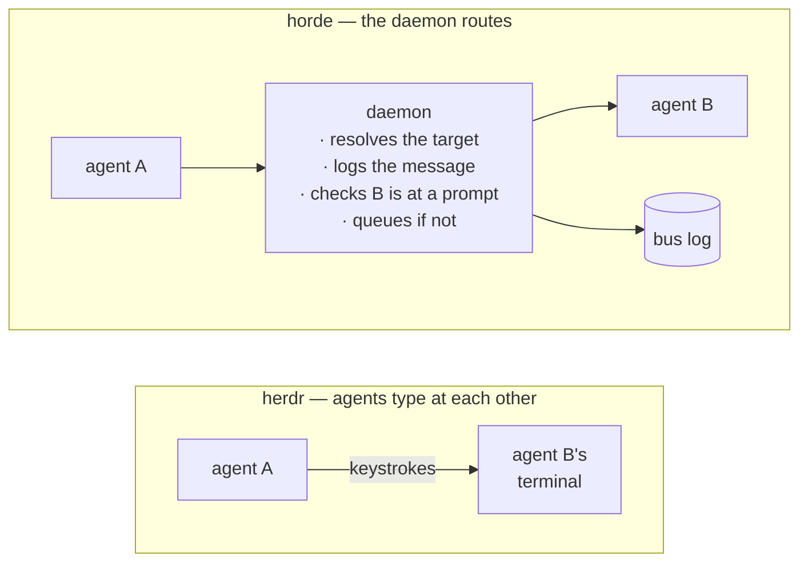

# horde

**A terminal multiplexer for running coding agents side by side — where the agents can actually talk to each other.**

horde is a personal rebuild of [herdr](https://herdr.dev), keeping the parts that matter (spaces, agent management, pane layouts) and rebuilding the one part herdr never really solved: **agent-to-agent communication.**

Rust + ratatui, one binary, macOS. A background daemon owns the real PTYs, so agents keep running when you close the terminal.

---

## The one decision everything else follows from

herdr's own documentation describes agent communication like this: agents "communicate through panes." In practice that means **agent A types keystrokes into agent B's terminal.**

horde does not do that. In horde, agents hand a message to the daemon, and **the daemon delivers it.**



That sounds like an implementation detail. It is the whole difference, because a router can do four things a keystroke cannot:

| | typing into a pane | routing through a daemon |
|---|---|---|
| **Who was it for?** | wherever the cursor was | a resolved, named target |
| **Did it arrive?** | unknowable | `delivered`, `queued`, or `dropped` |
| **Is there a record?** | scrollback, until it scrolls | an append-only log |
| **What if they're busy?** | you interrupt them mid-stream | held, then delivered when they reach their prompt |

Two details worth calling out, because both were found the hard way:

- **Delivery is gated on the recipient's state.** horde writes to a pane only when that agent is at a prompt (`idle` or `blocked`). Send to a busy agent and the message is *queued*, then flushed the moment it goes idle. `queued` is a normal result, not a failure — and the bus drawer shows it, so a held message is visible rather than silently lost. Typing into a pane mid-stream races whatever the agent is emitting; that's the flaw the gate exists to close.
- **Enter is sent as a separate write.** Agents treat text-plus-Enter arriving together as a *paste* and insert a newline instead of submitting. So horde sends the body, then submits ~120ms later. Without this, messages arrive and just sit in the prompt box, unsent.

Everything below is only possible because the bus exists.

---

## 1. `horde ask` — delegation that returns a value

One agent asks another a question and gets the answer back as a value.

```bash
verdict=$(horde ask reviewer "does src/bus.rs handle a dropped pane?")
```

That call **blocks**. The recipient sees `[horde] request #42 from builder: ...` and answers:

```bash
horde reply 42 "yes — it queues and flushes on the next idle pass"
```

The answer prints on the asker's stdout, in a shell variable, ready to branch on.

**Why this is new.** herdr has no reply channel — there's no message id to answer, and no way for a sender to know an answer ever came. `ask` turns delegation from *fire and hope* into a function call, and it only works because the daemon holds the request open and knows which reply belongs to it.

**Commands**

```bash
horde ask <name> "question"           # blocks, prints their answer
horde ask <name> "q" --timeout 600    # default 300s
horde reply <id> "answer"             # what the recipient runs
horde send <name> "text"              # one-way, when you don't need an answer
horde broadcast "text"                # everyone but you
```

---

## 2. The shared task board — stop being the scheduler

The bus pushes work *at* a named agent. The board is the other direction: work sits there, and whoever is free takes it.

```bash
horde task add "write tests for src/bus.rs"
horde task add "check the docs for stale command names"
horde task add "port the old parser"
```

Every agent then runs the same loop, so adding agents adds throughput with no decisions from you:

```bash
while work=$(horde task claim); [ -n "$work" ]; do
  # do $work as a normal turn — think, edit, test
  horde task done --result "18 tests added, all passing"
done
```

**Why this is new.** herdr has no board. You dispatch by hand, which makes *you* the bottleneck — a fast agent sits idle while a slow one queues three jobs behind it. The board self-balances.

Two guarantees make it trustworthy:

- **A claim is exclusive.** It's a compare-and-set that only succeeds from `open`, serialised by the daemon's single-threaded engine. Two agents claiming at the same instant get different tasks — never the same one. Losing the race is a visible error, never a silent duplicate.
- **A dead agent doesn't take work with it.** If a pane closes while holding a task, horde returns it to the board and says why. Every tick sweeps for tasks whose owner is no longer a live pane — phrased as *who is still here* rather than *who left*, because a pane that dies before detection ever named it leaves no departure to notice.

An empty board prints `nothing on the board` and exits **0**, not an error — a worker loop has to be able to tell "no work" from "broken."

**Commands**

```bash
horde task add "text"            # put work up for whoever is free
horde task claim                 # take the oldest open one
horde task claim 4               # take a specific one
horde task done --result "..."   # finish what you hold
horde task release 4             # hand it back  (--drop to abandon)
horde task list                  # outstanding  (--all shows finished + results)
```

The sidebar footer carries the count next to the agent states — `◇ 3 tasks open` — so one glance answers "is anything outstanding."

---

## 3. Rich activity — the sidebar says what an agent is *doing*

herdr tells you an agent's **state**. horde tells you the state *and the shape of the work behind it*:

```
◍ reviewer    needs you
◐ builder     14 tools · 3 files
◐ tester      9 tools · 2 failed
○ docs        idle
```

`◐ working` for six minutes is ambiguous — grinding through 40 tool calls, or stuck in a loop? `9 tools · 2 failed` is a reason to go look. Failures outrank the file count on purpose: one is something you may need to act on, the other is texture.

This comes from Claude Code's lifecycle hooks, which also make state detection exact rather than guessed:

```bash
horde integration install claude
```

It merges into `~/.claude/settings.json`, backs the file up first, leaves other tools' hooks alone, and is safe to re-run. Restart running Claude sessions afterwards.

> Why it matters beyond the pretty numbers: screen-scraping reads whatever is on screen, and Claude's `esc to interrupt` marker sits at the end of a long status line. A narrow pane truncates it and a working agent looks idle. Hooks don't care how wide your panes are.

---

## 4. `horde digest` — what happened while you were away

Detach, go to lunch, come back. Instead of five panes of scrollback:

```
while you were away · 42m

  needs you
    ◍ reviewer         stuck 12m    approval prompt

  finished
    ● builder          4m           22 tools · 6 files

  board
    ● #4   write the bus tests  [builder]
           → 18 tests added, all passing
    ✕ #6   port the old parser  [tester]
           → dropped, no result
    2 open, 1 claimed

  bus · 3 messages
    ✓ ask #7 builder → reviewer: is the gating logic sound?
    ✓ re #7 reviewer → builder: yes — queued messages flush on the next idle pass

  exited
    ✕ worker3
```

On reattach you also get a one-line toast: *"while you were away: 1 agent needs you, 2 tasks done — see `horde digest`"*.

**Why this is new.** Neither herdr nor tmux has an equivalent — both hand your panes back and leave you to scroll. horde was already keeping the records, so it can just answer. Three logs each own their own facts (the bus owns messages, the board owns tasks, a journal owns state changes and exits), so nothing is reported twice.

The order is by what would make you act: what's stuck, then what finished, then the board, then the chatter.

The window is *since you last looked* — reading advances the marker, so ignoring digests **widens** the window instead of losing history. The marker is written to disk, because a daemon restart is exactly the kind of thing that happens during the hour you weren't watching.

**Commands**

```bash
horde digest                # since you last looked
horde digest --since 2h     # a wider window
horde digest --keep         # look without advancing the window
horde digest --json         # for scripts
```

---

## Side by side

| | herdr | horde |
|---|---|---|
| Agent messaging | agents type into each other's panes | daemon routes, logs, and gates delivery |
| Delivery feedback | none | `delivered` / `queued` / `dropped`, shown live |
| Busy recipient | interrupted mid-stream | queued, flushed when they reach a prompt |
| Request → reply | — | `horde ask` blocks and returns the answer |
| Shared work queue | — | task board with exclusive claims + auto-reclaim |
| Agent readout | state | state + tools / files / failures per turn |
| Catch-up after detach | scroll the panes | `horde digest` |
| Message history | scrollback | append-only log + live bus drawer |

**Where herdr is still ahead:** it's a real product with a plugin marketplace, cross-platform support, SSH, git worktree integration, and remote manifest updates. horde deliberately dropped all of that — it's a personal local tool for one machine. What it does instead is take the one thing herdr treats as a footnote and make it the foundation.

---

## Getting started

```bash
horde                                     # attach (spawns the daemon if needed)
horde integration install claude          # once, so agents report their own state

# build a team and give it a queue
for f in src/*.rs; do horde task add "review $f, report anything broken"; done
for n in a b c; do horde spawn --cmd claude --name "$n"; done
horde broadcast "work the board: horde task claim, then horde task done --result"

# ...go away...

horde digest                              # what the three of them got done
horde task list --all                     # every result
```

Keys are tmux-shaped — `ctrl+b` prefix, `-` and `|` to split, `hjkl` to move, `d` to detach. `ctrl+b a` jumps to the next agent that needs you, `ctrl+b b` toggles the bus drawer.

Agents get their own instructions: `horde integration install claude` also installs a Skill that teaches them `ask`, `reply`, and the board — so they use them without being told each time. Full reference is `horde docs orchestration`.
